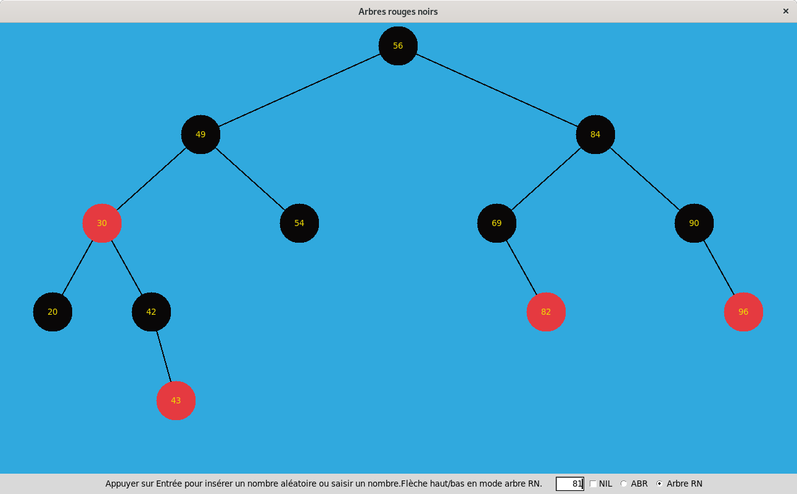
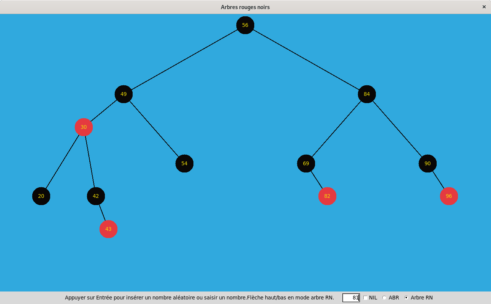
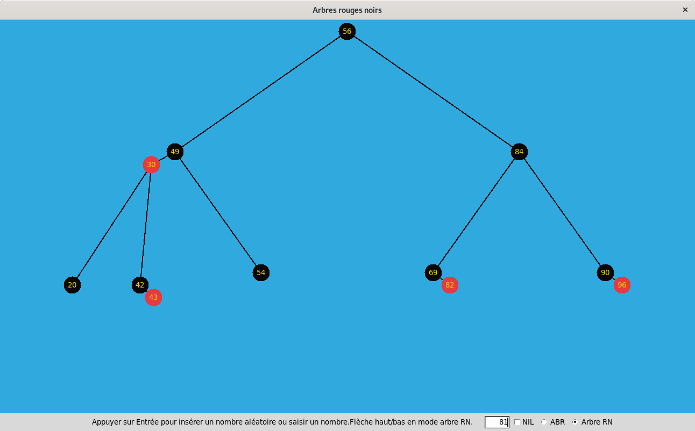
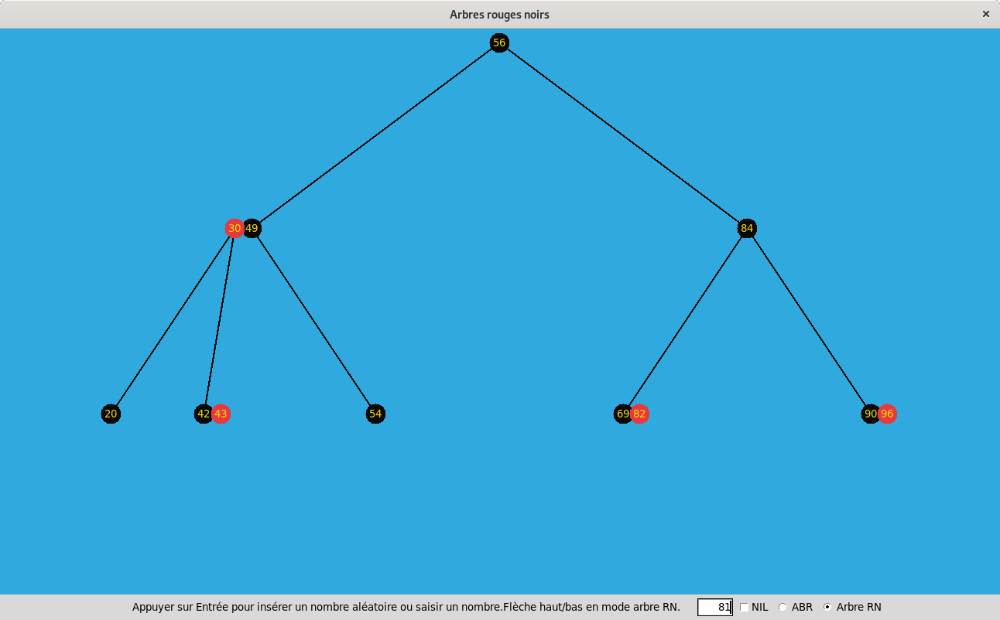

# arbresRougeNoir

Outil de visualisation des arbres rouge-noir et de l'arbre 2-3-4 qui lui est isomorphe.

# Propriétés d'un arbre rouge-noir

    Un arbre rouge-noir vérifie les propriétés suivantes:
       1. Un noeud est soit rouge soit noir.
       2. La racine et les noeuds vides (~ NIL) sont noirs.
       3. Si un noeud est rouge, ses enfants sont noirs.
       4. Tous les chemins d'un noeud jusque ses descendants vides ont le même
          nombre de noeuds noirs.

# ArbresRN.py implémente:
  - une classe NoeudRN représentant un noeud dans un arbre rouge-noir.
  - l'insertion en tant qu' arbre binaire de recherche
  
# tk_arbres.py implémente:
 - représentation graphique des arbres
 
# Exemple:

## Arbre initial:

## Transition 1:

## Transition 2:

## Arbre 2-3-4

